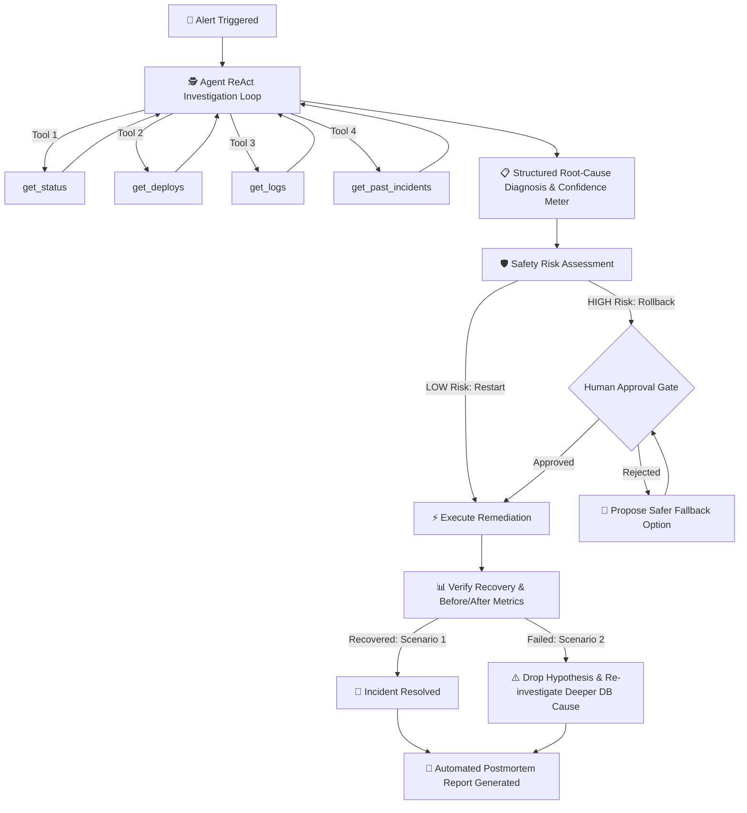

# 🛡️ DevOps Copilot: The AI Incident Response Agent

DevOps Copilot is an autonomous Site Reliability Engineering (SRE) assistant that investigates, diagnoses, and remediates production service outages. Powered by the Google Gemini API and tool-calling capabilities, it inspects real-time service metrics, application error logs, deployment histories, and past incident postmortems to determine root cause with calibrated confidence. Built with safety-first human-in-the-loop controls, it enforces explicit human approval for high-risk remediations (such as production rollbacks) before executing changes and generating postmortem incident reports.

---

## 📸 Interface Preview
```
+----------------------------------------------------------------------------------------------------+
|  🚨 CRITICAL OUTAGE ALERT: payment-service (v2.4.0) is reporting 43.5% HTTP 500 errors!            |
+----------------------------------------------------------------------------------------------------+
|  [Sidebar]                 | [Main Investigation Feed]                                             |
|  - Scenario 1: Bad Deploy  |  🔍 Checking get_status... CRITICAL (43.5% error rate)                |
|  - Scenario 2: Fix Fails   |  🔍 Checking get_deploys... v2.4.0 ('Updated DB pool config...')      |
|  - [x] Offline Demo Mode   |  🔍 Checking get_logs... 36 ConnectionPoolExhaustedException lines    |
|  - [🚨 Trigger Alert]      |  🔍 Checking get_past_incidents... Found INC-892                      |
|                            |-----------------------------------------------------------------------|
|                            | 📋 Root Cause Analysis: Pool size reduced from 50 to 10 in v2.4.0.     |
|                            | Confidence: 95% [========================================]            |
|                            |-----------------------------------------------------------------------|
|                            | 🛡️ Approval Gate: Proposed Rollback to v2.3.9 [🚨 HIGH RISK]          |
|                            | [✅ Approve Fix]        [❌ Reject Proposal]                          |
|                            |-----------------------------------------------------------------------|
|                            | 📊 Verification: Recovered to HEALTHY (Error rate: 0.2%)               |
|                            | 📄 Postmortem: Automated Markdown Incident Report generated           |
+----------------------------------------------------------------------------------------------------+
```

---

## 🏗️ Architecture Overview

The system operates across three modular layers:
1. **Simulation Layer (`simulation/environment.py`)**: A stateful infrastructure sandbox that tracks live service health, database connection pools, deployment registries, log streams, and past incident records in JSON files. No real servers, databases, or cloud accounts are required.
2. **Autonomous Agent Layer (`agent/`)**:
   - `coordinator.py`: Implements a manual multi-turn ReAct (Reasoning + Acting) loop with 4 diagnostic tools (`get_status`, `get_deploys`, `get_logs`, `get_past_incidents`) and structured JSON output.
   - `planner.py`: Classifies remediation risks (Rollback = `HIGH`, Restart = `LOW`), enforces approval gates, and calculates next-best fallback options.
   - `gemini_gateway.py`: Unified API gateway with exponential backoff, rate-limit resilience, and automatic fallback to verified demo cache.
   - `reporter.py`: Generates standardized Markdown postmortem reports grounded strictly in collected telemetry.
3. **Interactive UI (`app.py`)**: A Streamlit dashboard displaying live step-by-step tool execution, root-cause confidence meters, human approval cards, before/after recovery metrics, and downloadable incident postmortems.

---

## 🚀 Quickstart & Setup

### Prerequisites
- Python 3.11+
- pip

### 1. Clone & Set Up Virtual Environment
```bash
git clone https://github.com/your-username/devops-copilot.git
cd devops-copilot

# Create virtual environment
python -m venv .venv

# Activate virtual environment
# Windows (PowerShell):
.venv\Scripts\Activate.ps1
# macOS/Linux:
source .venv/bin/activate
```

### 2. Install Dependencies
```bash
python -m pip install -r requirements.txt
```

### 3. Configure Environment Variables
Copy `.env.example` to `.env`:
```bash
cp .env.example .env
```
Edit `.env` and provide your Google Gemini API key:
```env
GEMINI_API_KEY=your_gemini_api_key_here
GEMINI_MODEL=gemini-3-flash-preview
DEMO_MODE=false
```

### 4. Run the Streamlit Application
```bash
python -m streamlit run app.py
```
Open your browser and navigate to `http://localhost:8501`.

---

## 🛡️ Demo Mode (Offline Safety Net)

DevOps Copilot includes a complete **Demo Safety Net** designed for live hackathon presentations, conference booths, and offline judging.

### How to use Demo Mode:
- **Option A (In the UI)**: Toggle the **"🛡️ Offline Demo Mode"** switch in the sidebar.
- **Option B (In `.env`)**: Set `DEMO_MODE=true` in your `.env` file.

When Demo Mode is active:
- The app operates **100% locally** with **NO internet** and **NO API key** required.
- Tool investigations, root-cause diagnoses, and postmortem reports are loaded from verified high-fidelity cached traces in `data/demo_cache/`.
- A transparent `🏷️ DEMO MODE ACTIVE (OFFLINE)` badge is displayed so evaluators know when cached safety data is being used.
- If live API mode is enabled but a sudden Wi-Fi dropout or Google API quota limit (`429`) occurs, the gateway automatically catches the failure and falls back to the demo cache instead of crashing!

---

## 🔄 How It Works: Incident Response Flow



### The Two Outage Scenarios
1. **Scenario 1 ("Bad Deploy")**: `payment-service` experiences 500 errors immediately following deploy `v2.4.0` (commit reduced pool size to 10). The AI correlates the commit message, logs, and historical incident `INC-892`. Rolling back to `v2.3.9` recovers service health to 100%.
2. **Scenario 2 ("Fix Fails")**: Outage coincides with deploy `v2.4.0`, but rolling back does **NOT** resolve the issue. The verification step catches that the fix failed, drops the application hypothesis, and initiates a secondary investigation that pinpoints PostgreSQL primary connection saturation (500/500 connection slots exhausted).

> **Note on Infrastructure**: All servers, databases, error logs, and metrics are simulated completely in-memory using localized JSON fixtures in `data/`. No external cloud resources or real production workloads are impacted.

---

## 🧪 Automated Testing

You can run our automated test suite anytime from the terminal:

```bash
# 1. Test simulation state machine and state mutations
python test_simulation.py

# 2. Test AI Agent core (autonomous tool calling & structured diagnosis)
python test_agent.py 1   # Run Scenario 1
python test_agent.py 2   # Run Scenario 2

# 3. Test Streamlit UI end-to-end (Headless AppTest runner)
python test_app.py
```

---

## 📄 License
MIT License. Built for hackathon demonstration.
